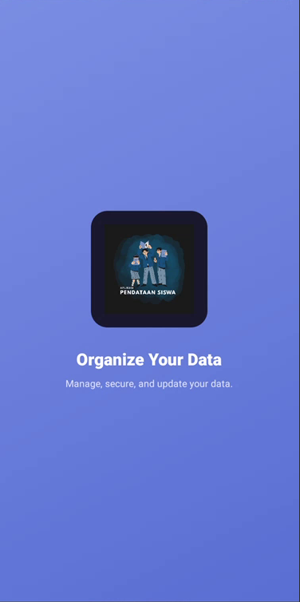
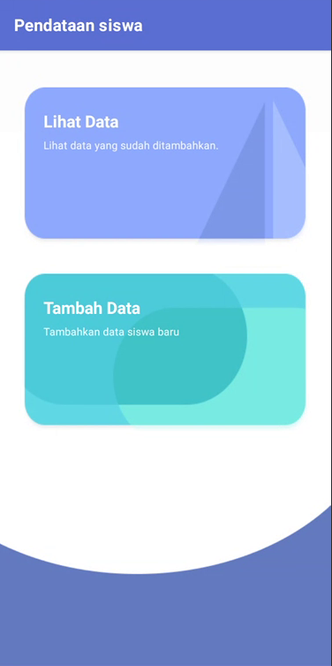
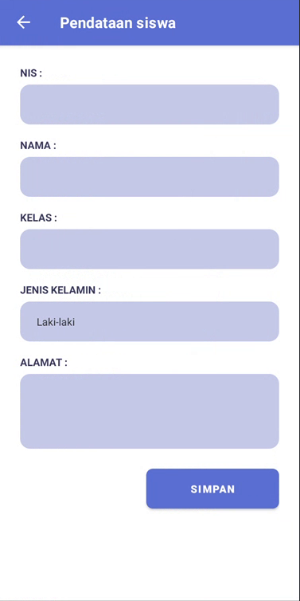
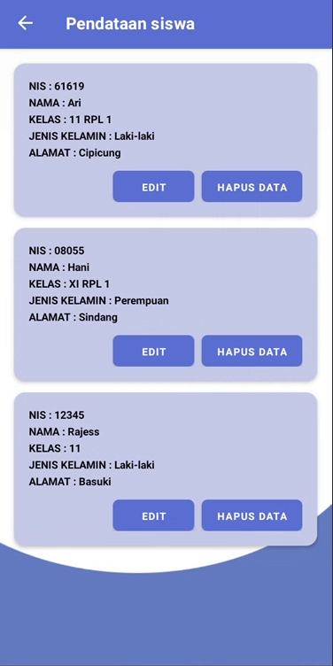

<div align="center">

# 📚 Pendataan Siswa


**Aplikasi Android untuk manajemen data siswa berbasis SQLite**

Kelola data siswa dengan mudah — tambah, edit, hapus, dan lihat data tersimpan secara lokal di perangkat.

---

## ⬇️ Download Aplikasi

<a href="[https://drive.google.com/your-link-here](https://drive.google.com/drive/folders/1O4dwLgIcVEQU5gwuG1Jxk8Cp-2NLSeMx?usp=drive_link)">
  
</a>

> **Cara update link download:**
> 1. Build APK: **Android Studio → Build → Build APK(s)**
> 2. Upload file `app-debug.apk` ke Google Drive
> 3. Share → Anyone with the link → Copy link
> 4. Ganti `https://drive.google.com/your-link-here` di atas dengan link kamu

---

</div>

## 📱 Tampilan Aplikasi

| Splash Screen | Menu Utama | Tambah Data | Lihat Data |
|:---:|:---:|:---:|:---:|
|  |  |  |  |

> 💡 Buat folder `screenshots/` di root project dan tambahkan screenshot aplikasi kamu.

---

## ✨ Fitur Aplikasi

- 🔵 **Splash Screen** — Animasi pembuka otomatis 2.5 detik
- 🏠 **Menu Utama** — Navigasi ke Lihat Data & Tambah Data
- ➕ **Tambah Data** — Form input siswa baru dengan validasi
- 📋 **Lihat Data** — Daftar semua siswa menggunakan RecyclerView
- ✏️ **Edit Data** — Klik tombol Edit, form terisi otomatis
- 🗑️ **Hapus Data** — Dialog konfirmasi sebelum menghapus
- 💾 **SQLite** — Data tersimpan permanen di perangkat tanpa internet

---

## 🗄️ Struktur Database

**Nama Database:** `pendataan_siswa.db` &nbsp;|&nbsp; **Tabel:** `siswa`

| Kolom | Tipe | Keterangan |
|-------|------|------------|
| `id` | INTEGER | Primary Key, Autoincrement |
| `nis` | TEXT | Nomor Induk Siswa |
| `nama` | TEXT | Nama lengkap siswa |
| `kelas` | TEXT | Kelas siswa |
| `jenis_kelamin` | TEXT | Laki-laki / Perempuan |
| `alamat` | TEXT | Alamat lengkap siswa |

---

## 🚀 Cara Menjalankan Project

### Prasyarat
- ✅ Android Studio **Hedgehog** atau lebih baru
- ✅ JDK 8+
- ✅ Android SDK minimum **API 21 (Android 5.0 Lollipop)**

### 1. Clone Repository
```bash
git clone https://github.com/username/PendataanSiswa.git
cd PendataanSiswa
```
> Ganti `username` dengan username GitHub kamu

### 2. Buka di Android Studio
```
1. Buka Android Studio
2. Pilih File → Open
3. Arahkan ke folder hasil clone
4. Tunggu Gradle Sync selesai
5. Klik Run ▶️ atau tekan Shift + F10
```

### 3. Jalankan di Emulator / HP
- **Emulator:** Buat AVD di Device Manager, pilih API 21+
- **HP langsung:** Aktifkan Developer Options + USB Debugging, lalu colok ke PC

---

## 📦 Cara Build & Upload APK

### Build APK
```
Android Studio → Build → Build Bundle(s) / APK(s) → Build APK(s)
```
File APK tersimpan di:
```
app/build/outputs/apk/debug/app-debug.apk
```

### Upload ke Google Drive
```
1. Buka drive.google.com
2. Klik + New → File upload
3. Pilih file app-debug.apk
4. Klik kanan file → Share → Anyone with the link
5. Salin link → tempel di bagian Download di README ini
```

---

## 📁 Struktur Project

```
PendataanSiswa/
├── app/
│   └── src/main/
│       ├── java/com/example/pendataansiswa/
│       │   ├── 📄 DatabaseHelper.java      ← SQLite CRUD
│       │   ├── 📄 Siswa.java               ← Model data
│       │   ├── 📄 SplashActivity.java      ← Halaman splash
│       │   ├── 📄 MainActivity.java        ← Menu utama
│       │   ├── 📄 TambahDataActivity.java  ← Form tambah/edit
│       │   ├── 📄 LihatDataActivity.java   ← Daftar siswa
│       │   └── 📄 SiswaAdapter.java        ← RecyclerView Adapter
│       ├── res/
│       │   ├── layout/
│       │   │   ├── activity_splash.xml
│       │   │   ├── activity_main.xml
│       │   │   ├── activity_tambah_data.xml
│       │   │   ├── activity_lihat_data.xml
│       │   │   └── item_siswa.xml
│       │   ├── drawable/
│       │   │   └── bg_*.xml
│       │   └── values/
│       │       ├── strings.xml
│       │       ├── colors.xml
│       │       └── themes.xml
│       └── AndroidManifest.xml
├── screenshots/
└── README.md
```

---

## 🛠️ Teknologi yang Digunakan

| Teknologi | Versi | Keterangan |
|-----------|-------|------------|
| Java | 8+ | Bahasa pemrograman utama |
| SQLite | built-in | Database lokal perangkat |
| RecyclerView | 1.3.2 | Tampilan daftar data |
| Material Components | 1.11.0 | Komponen UI modern |
| AlertDialog | built-in | Dialog konfirmasi hapus |

---

## ⚠️ Catatan Penting

- Gunakan theme `Theme.MaterialComponents.Light.DarkActionBar` agar warna header sesuai tema biru
- Pastikan semua file `bg_*.xml` sudah ada di folder `res/drawable/`
- `SplashActivity` harus menjadi LAUNCHER di `AndroidManifest.xml`
- APK debug hanya untuk testing, gunakan **Release APK** untuk distribusi resmi

---

## 🤝 Kontribusi

1. Fork repository ini
2. Buat branch baru: `git checkout -b fitur-baru`
3. Commit perubahan: `git commit -m 'Tambah fitur baru'`
4. Push ke branch: `git push origin fitur-baru`
5. Buat Pull Request

---

<div align="center">

Dibuat dengan ❤️ menggunakan **Android Studio** & **Java**

⭐ Jangan lupa beri bintang kalau project ini membantu!

</div>
